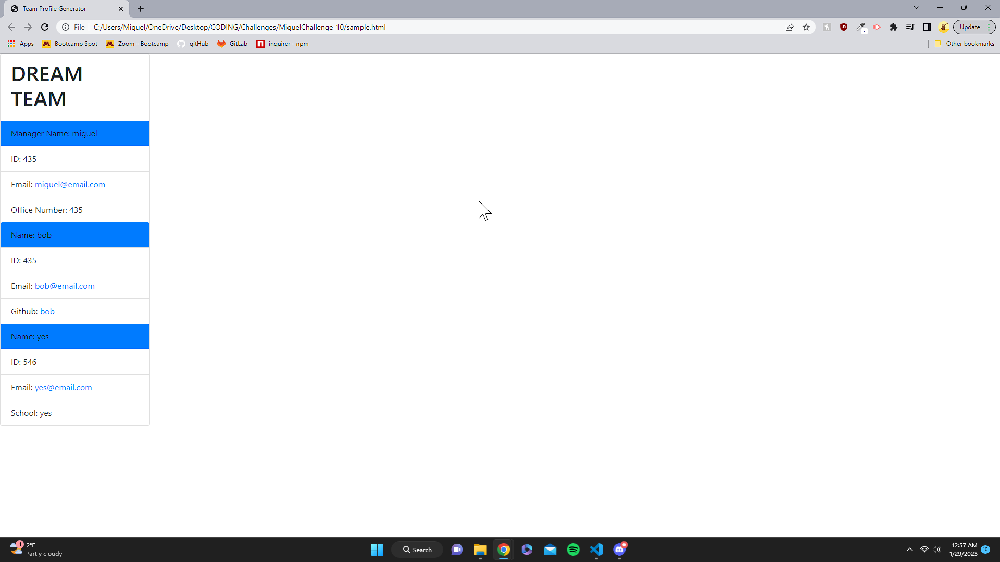

# Team Profile Generator

   ## Description
   A Generator that will create your professional dream team based on the the input provided by you
   
   ## Table of Contents
   - [Description](#description)
   - [Installation](#installation)
   - [Tests](#tests)
   - [Credits](#credits)
   - [How to Contribute](#ContributionGuidelines)
   - [Badge](#badge)
   - [Questions](#questions)

   ## Installation
   npm i and jest

   ## Tests
   Value tests on all of the classes that were created

   
   
   
   

   ## Credits
   I had two different tutors, Dennis and Blake D. Also TAs Jessica and Chris helped me as well

   Links utilized in this project: 
   https://www.npmjs.com/package/jest?activeTab=readme
   https://umn.bootcampcontent.com/University-of-Minnesota-Boot-Camp/UofM-VIRT-FSF-PT-10-2022-U-LOLC/-/tree/main/10-OOP/02-Challenge

   As well as the Mini project and various other activities from Module 10

   ## Badge
   MIT License:   

   ## Questions
   If you have any further questions please follow up with me at: https://github.com/DarkunitX or you can email me at Darkunitx@live.com